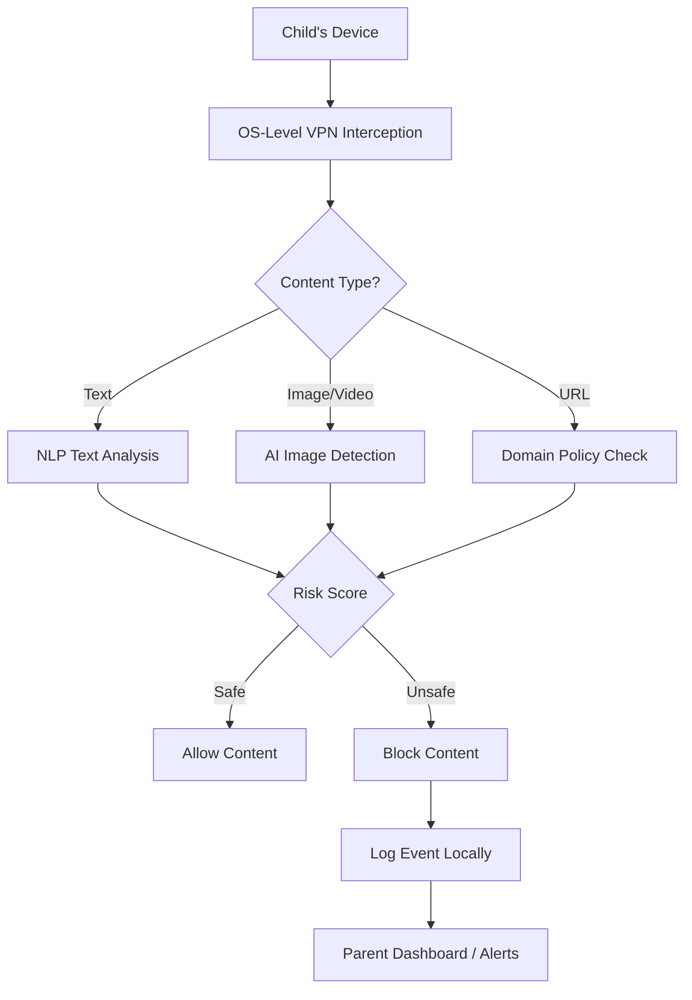

# 🛡️ ChildSafetyOS (SafeBrowse)

> **A Digital Guardian Angel for Children on the Internet**

ChildSafetyOS (codename **SafeBrowse**) is an **OS-level parental control and child safety platform** designed to protect children from harmful online content **in real time**, without spying, cloud uploads, or easy bypasses. Built during **Ranchi Hacks 2026** by **Team BYTE US**, this project focuses on **privacy-first, on-device AI** combined with deep system-level protection.

---

## 🚨 The Problem

Children today are exposed to:

* Harmful and explicit content
* Online grooming and exploitation
* Violent, adult, and unsafe material

📉 **The real issue:**
Parents have **zero real-time visibility** into what children actually see online, and most existing parental control apps can be **uninstalled, force-stopped, or bypassed** easily.

---

## 💡 Our Solution

**ChildSafetyOS** reimagines parental control by moving safety **into the Operating System itself**, instead of treating it as a removable app.

### ✨ Key Philosophy

* Safety at **OS level**, not app level
* **Cannot be uninstalled or bypassed** by kids
* **All AI runs locally** (no cloud spying)
* Set-and-forget protection for parents

---

## 🧠 How It Works (High-Level)

ChildSafetyOS uses a **Three-Layer Defense System**:

1. **The Gatekeeper** – Intercepts all internet traffic
2. **The Brain** – On-device AI analyzes content
3. **The Enforcer** – Prevents tampering and bypass

---

## 🔄 System Flow (Simplified Flowchart)

---

## 🧱 Three-Layer Defense Architecture

### 1️⃣ The Gatekeeper – VPN-Based Traffic Filtering

* Uses **Android VPN Service API**
* Intercepts **100% internet traffic** at OS level
* Routes all app data through a **local VPN tunnel**
* Integrates **Cloudflare Family DNS (1.1.1.3)** for extra safety
* Runs as a **foreground service** (cannot be killed)

📁 Key File:

* `SafeVpnService.kt`

---

### 2️⃣ The Brain – On-Device AI 🧠

#### 🔍 Image Analysis

* Real-time image scanning using **TensorFlow Lite**
* Lightweight **MobileNet-based CNN**
* Detects:

  * Nudity
  * Violence
  * Explicit visuals

#### 📝 Text Analysis

* Context-aware NLP (not keyword-only)
* Blocks risky terms but allows safe context

  * Example: blocks `p*rn` but allows `popcorn`
* 600+ weighted keywords with risk scoring

📁 Key Files:

* `TfLiteManager.kt`
* `ImageMlQueue.kt`
* `TextRiskClassifier.kt`
* `ContextTextAnalyzer.kt`

🔒 **Privacy Guarantee:**

> No images, text, or logs are uploaded to the cloud.

---

### 3️⃣ The Enforcer – Tamper Protection 🔐

* Uses **Android Accessibility Services**
* Monitors UI actions in real time
* Instantly blocks:

  * VPN disable attempts
  * App uninstall
  * Force stop / clear data
  * Access to system settings

👨‍👩‍👧 Control:

* Only parents can unlock settings using a **Safe PIN**

📁 Key File:

* `AppLockService.kt`

---

## 🧩 Key Components

### 📱 Child’s Android Device

* `MainActivity` (Jetpack Compose UI)
* `SafeBrowserActivity` (Filtered WebView)
* VPN Service
* Accessibility Service
* TensorFlow Lite Models

### ⚙️ Policy & AI Engine

* `PolicyEngine`
* `DomainPolicy` (100+ blocked categories)
* `ThresholdProvider` (Child / Teen / Adult modes)

### ☁️ Firebase (Support Layer)

* Firestore (real-time logs)
* Cloud Functions (email alerts)
* FCM (push notifications)

### 🖥️ Parent Dashboard

* Web dashboard (HTML + JS)
* Live statistics
* Activity logs
* Severity-based filters

---

## 📊 Age-Based Safety Thresholds

| Mode     | Explicit Threshold | Sexy Threshold | Behavior              |
| -------- | ------------------ | -------------- | --------------------- |
| 👶 Child | 0.20               | 0.35           | Very strict filtering |
| 🧑 Teen  | 0.40               | 0.60           | Moderate filtering    |
| 🧔 Adult | 0.70               | 0.80           | Relaxed but safe      |

---

## 🧰 Technology Stack

| Layer      | Technology                          |
| ---------- | ----------------------------------- |
| Mobile App | Kotlin, Jetpack Compose             |
| OS Network | Android VPN Service API             |
| AI/ML      | TensorFlow Lite                     |
| Backend    | Firebase Firestore                  |
| Cloud      | Firebase Cloud Functions (Node.js)  |
| Dashboard  | HTML, CSS, JavaScript               |
| Security   | Accessibility Service, Device Admin |

---

## 🚀 Current Status

✅ VPN-based traffic filtering
✅ Domain blocking (100+ categories)
✅ On-device AI image detection
✅ AI text analysis
✅ Safe Browser
✅ Settings lock & tamper protection
✅ Parent dashboard with live stats
✅ Email alerts

---

## 🔮 Future Roadmap

* YouTube content filtering
* Screen-time management
* Multi-device family support
* iOS version
* School admin dashboard
* Grooming detection in chat apps
* Federated learning
* Geofencing
